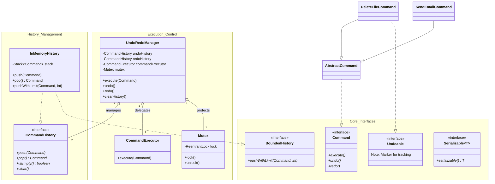
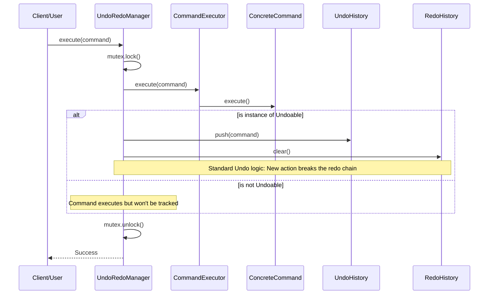
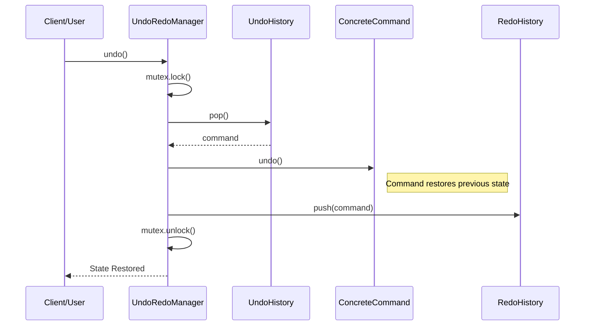

# Universal Undo-Redo System (LLD)

A professional-grade, thread-safe, and highly extensible Undo-Redo system built using the **Command Design Pattern**. This architecture is designed to handle complex state management in applications (like text editors, file systems, or financial tools) while maintaining strict decoupling and memory efficiency.

---

## 🏛️ Deep Dive Architecture

### 1. Detailed Class Diagram
This diagram shows the static structure of the system, highlighting the interfaces, their implementations, and the relationships that enable decoupling.



---

### 2. Operational Sequence Diagrams

#### A. Command Execution Workflow
This diagram illustrates what happens when a user triggers a new action. Notice how the system automatically clears the "Redu" stack and decides whether to track the command based on the `Undoable` interface.



#### B. The Undo Process
Shows the step-by-step movement of a command from the Undo stack back to the Redo stack after reversing its effects.



---

## 🧩 Detailed Class & Strategy Explanation

### **The manager (`UndoRedoManager`)**
*   **Why**: Centralized control. Without it, the UI would have to manually manage stacks and thread locks.
*   **What**: It coordinates the two stacks (`undo` and `redo`) and ensures that if one action is undone, it's ready to be redone.
*   **How**: It uses a **Composition** strategy. It doesn't care how the history is stored (In-Memory, Database, etc.) or how the command works; it only interacts with the `Command` and `CommandHistory` interfaces.

### **The History Strategy (`InMemoryHistory`)**
*   **Why**: Memory management. Storing infinite history leads to `OutOfMemoryError`.
*   **What**: Implements a Stack-based storage with **History Limiting**.
*   **How**: When `pushWithLimit` is called, it checks if the stack size exceeds the limit. If it does, it removes the **oldest** element (index 0) before adding the new one. This is a circular-buffer-like behavior using a Stack.

### **The Command Abstraction (`AbstractCommand`)**
*   **Why**: Reduces boilerplate code.
*   **What**: Most commands treat `redo` exactly like their initial `execute`.
*   **How**: It provides a default `redo()` implementation that simply calls `execute()`, so concrete commands only need to define `execute` and `undo`.

### **Thread Safety (`Mutex`)**
*   **Why**: Race conditions. If two threads call `undo()` at the exact same millisecond, both might try to pop the same command.
*   **What**: A wrapper around `ReentrantLock`.
*   **How**: Every public method in `UndoRedoManager` is wrapped in a `lock()` / `finally { unlock() }` block. This ensures **atomic** operations.

---

## � Project Structure
```text
src/core/
├── exceptions/    # Custom errors (UndoNotSupported, etc.)
├── history/       # Implementations of Command storage
├── interfaces/    # The "Contract" (Command, Undoable, Bounded)
├── manager/       # The brain (UndoRedoManager, Executor)
└── utils/         # Concrete commands and helpers (Mutex, Limiter)
```

## 🚀 Testing & Validation
The system includes a custom test runner in `App.java` that simulates real-world usage:
1.  **Compile**: `javac -d bin -sourcepath src src/App.java`
2.  **Run**: `java -ea -cp bin App`

### Key Test Scenarios:
- **Redo Chain Break**: Validates that executing a new command after an undo clears the redo history.
- **Exception Safety**: Ensures the system doesn't crash if you try to undo/redo with an empty history.
- **Marker Interface Logic**: Validates that commands *not* implements `Undoable` are ignored by the history tracker.
