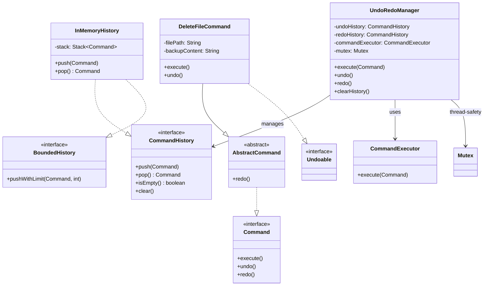

# Universal Undo-Redo System (LLD)

A robust, thread-safe, and extensible Undo-Redo system built using the **Command Pattern**. This system allows you to manage any sequence of operations with support for history limiting, thread safety, and custom command implementations.

## 🏗 System Architecture (Mermaid)



---

## 📂 Class Explanations

### 1. Core Interfaces
- **`Command`**: The base interface for all operations. Every command must define how to `execute()`, `undo()`, and `redo()`.
- **`Undoable`**: A marker interface. If a command implements this, it tells the `UndoRedoManager` that this command should be tracked in the undo history.
- **`CommandHistory`**: Defines the contract for storing commands (push, pop, clear).
- **`BoundedHistory`**: An extension for history implementations that support a maximum size limit (prevents memory issues).

### 2. Management Layer
- **`UndoRedoManager`**: The brain of the system.
    - **How it works**: When you `execute()` a command, it uses the `CommandExecutor` to run it. If it's an `Undoable` command, it saves it to the `undoHistory`.
    - **Undo/Redo**: When `undo()` is called, it pops from undo history, calls `undo()`, and moves it to redo history.
    - **Thread Safety**: Uses a `Mutex` to ensure that history isn't corrupted when multiple threads execute commands simultaneously.
- **`CommandExecutor`**: A simple wrapper to trigger the `execute()` method of a command. This decouples the "when" of execution from the "how".

### 3. Implementations & Utils
- **`InMemoryHistory`**: A standard implementation using a Java `Stack`. It also supports the `BoundedHistory` interface to remove the oldest commands when the limit is reached.
- **`AbstractCommand`**: A helper class that provides a default implementation for `redo()` (which usually just calls `execute()`).
- **`DeleteFileCommand`**: A concrete example of a command.
    - **Execute**: Removes a file from a mock filesystem and keeps a backup.
    - **Undo**: Restores the file from the backup.
- **`Mutex`**: A wrapper around `ReentrantLock` used to ensure only one thread modifies the history at a time.

---

## 🚀 How to Run Tests

The project includes a built-in test runner in `App.java` that validates the logic and provides a JUnit-like summary.

### Compilation
```bash
javac -d bin -sourcepath src src/App.java
```

### Execution (with assertions enabled)
```bash
java -ea -cp bin App
```

### Expected Output
```text
==========================================
       Running Undo-Redo System Tests       
==========================================

Running: Test Basic Execute and Undo ... PASSED
Running: Test Redo Functionality ... PASSED
...
------------------------------------------
Tests Finished!
Passed: 6
Failed: 0
------------------------------------------
```

## 🛠 Features
- ✅ **Undo/Redo**: Full state management.
- ✅ **Thread Safe**: Safe for concurrent environments.
- ✅ **History Limiting**: Prevents memory leaks by capping history size.
- ✅ **Selective Tracking**: Only commands marked as `Undoable` are tracked.
- ✅ **Clean Architecture**: Highly decoupled and easy to extend.
